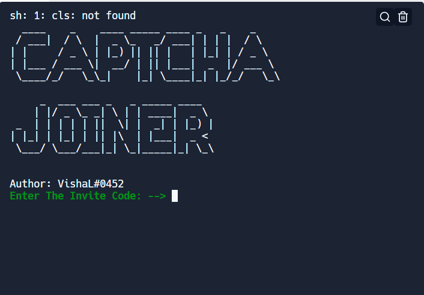

# How to Use
1. Input your tokens
2. Input your proxies (HTTP Proxies ONLY! BUY SOME CHEAP ONES FROM HERE: [[https://www.webshare.io/?referral_code=vfoze0j60n05](https://proxy-seller.com/?utm_source=google&utm_medium=cpc&utm_campaign=Seller_India&utm_content=602895438958&utm_term=paid%20proxy&gclid=CjwKCAjw_ISWBhBkEiwAdqxb9oZ9hT3rwduqqvZfW3iBelaKhhOPdf1AC3QjGgcXVZ0hNac-RHvnBRoCNDkQAvD_BwE)])
3. configure config.json. leave the apikey blank if you're not looking to solve
4. Install all packages via "pip install -r requirements.txt"
5. Run the main.py file via "python main.py"
6. Input your server invite code, this is what is after discord.gg/
7. Input The amount of threads (The higher the faster)
8. Then you're done, your tokens should Start Joining the dedicated server
# Contacts
* Discord - @HazarD </>#8161
* Server - https://discord.gg/rzop
* If you come across any problems, just create an issue with a screenshot and I'll try to get it fixed ASAP
* Buy Api Key From Here :- https://anti-captcha.com/ , 
                         - https://capmonster.cloud/
# Features
* Server Joiner - ✅
* Make The requests even more real. Even lower chance of getting captcha - ✅

# Common Issues
*  Error Code: "'Response' object is not subscriptable" This is either due to your tokens being invalid/locked or your Proxies being dead. This is self explanatory and is not a proper issue with my code, but with the resources you are providing to the tool. Please come to me with an actual issue that deems the joiner of **Not** working condition

# Please Star or Fork To Help Me Out And Receive Regular Updates
